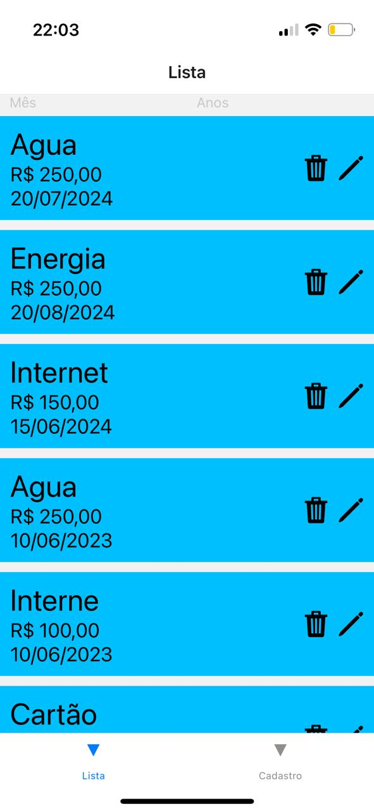
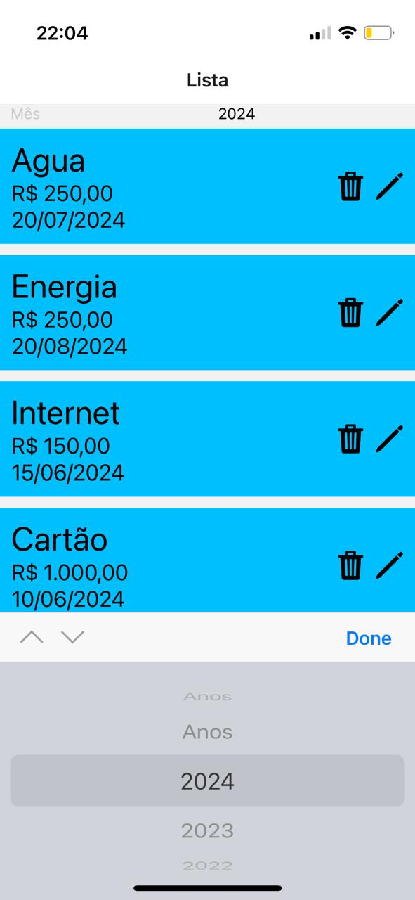
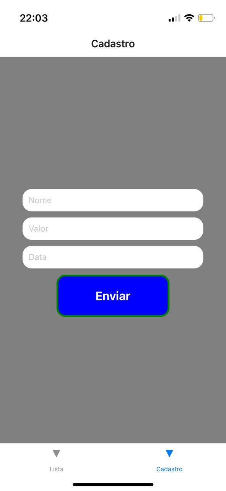

# Sobre o projeto
Projeto em react-native que realiza o cadastro, listagem e atualzação de finanças ultilizando o SQLITE

## 🛠️ Construído com

React-native 
javaScript

## dependencias usadas
SQLITE
Navigation
MaskInput
RNPickerSelect

## tela lista de financas:

## tela lotofácil:

## tela lotomania:

## tela mega:

